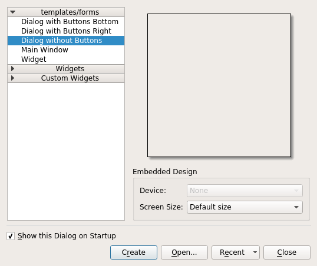
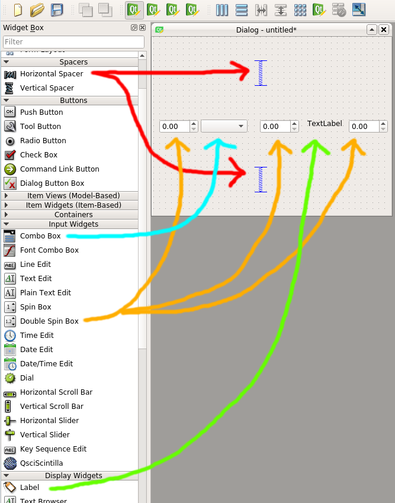
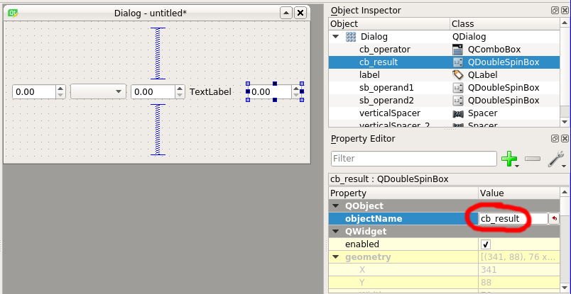

# Distribuce Pythonních aplikací

Máš napsaný program, teď ho stačí jen dostat k uživatelům. Ale jak?
Webovou aplikaci nasadíš na server; program, který má běžet na počítači
uživatele, je potřeba připravit jinak.

Ukážeme si jak napsat jednoduchý [*GUI*](https://cs.wikipedia.org/wiki/Grafick%C3%A9_u%C5%BEivatelsk%C3%A9_rozhran%C3%AD) program (s okýnkem a tlačítkem), a ukážeme si, jak ho „zabalit“:

* na *PyPI*, aby si ho mohl vyzkoušet kdokoli, kdo už má nainstalovaný Python,
* pro *Windows* jako `.exe`,
* pro Mac jako `.app`,

a možná další...


## Co budeš potřebovat

* Python 3.6
* Git
* Programátorský editor

Instalace & nastavení – viz [začátečnický kurz](http://naucse.python.cz/course/pyladies/sessions/install/).

### Účty na webových službách

Budeš-li mít před workshopem trochu času, založ si předem účty u těchto služeb (pokud je ještě nemáš):

* https://github.com
* https://travis-ci.org/ (pihlášení přes GitHub)
* https://www.appveyor.com/ (pihlášení přes GitHub)
* https://pypi.python.org/pypi?%3Aaction=register_form

### Knihovny z PyPI

Pro urychlení instalace si ve virtuálním prostředí nainstaluj následující:

```console
$ python -m pip install pyinstaller pyglet PyQt5 importlib-resources travis-encrypt
```

### Program k zabalení

* Máš-li Asteroidy ze začátenického kurzu, dej je do Gitu; můžeš pracovat s nimi!

* Pro tvorbu "okýnkové" aplikace si nainstaluj Qt Designer:
  * Fedora: `sudo dnf install qt5-designer`
  * Debian: `sudo apt-get install qttools5-dev-tools`
  * Mac: `brew install qt5; brew linkapps qt5`
  * Windows: [z instalátoru](https://www.qt.io/download-open-source/#section-2)


## Ukázkový program

Než začneme balit, potřebujeme nějaký program.
My si vytvoříme kalkulačku:

   

Případně můžeš použít i [Asteroidy] ze začátečnického kurzu (pokud je máš hotové),
nebo, kdyby kalkulačka nefungovala, [Dámu] ze vzorového repozitáře (naklonuj Gitem a přečti README).

[Asteroidy]: http://naucse.python.cz/course/pyladies/projects/asteroids/
[Dámu]: http://github.com/encukou/dama

### GUI šablona

Vytvoř si nový adresář, ve kterém budeš kalkulačku tvořit.

Aplikaci vytvoříme pomocí PyQt5, knihovny pro vytváření „klasických” grafických
uživatelských rozhraní. V aktivovaném virtuálním prostředí si ji nainstaluj pomocí:

```console
(venv)$ python -m pip install pyqt5
```

Poté spusť QT Designer, v úvodním okně vyber „Dialog without Buttons” a
klikni „Create”.

   

Poté nastrkej na okno uprostřed několik ovládacích prvků, podle obrázku:

   

Pak v menu vyber *Form* – *Lay Out in a Grid*.
Tím se prvky urovnají. Kdyby se neurovnaly správně, popřesunuj je myší.

Potom postupně poklikej na funkční prvky, a každému nastav
vlastnosti v *Property Editor*:

* První číslo:
    * *objectName* na `sb_operand1`
* Vybírací políčko: 
    * *objectName* na `cb_operator`
* Druhé číslo:
    * *objectName* na `sb_operand2`
* Textový popisek:
    * *text* na `=`
* Třetí číslo:
    * *objectName* na `sb_result`
    * *readOnly* zaškrtnout
* Samotné okno *Dialog*:
    * *windowTitle* na `Kalkulačka`

Pak vyber všechna tři políčka pro čísla (s <kbd>Ctrl</kbd>) a nastav jim:

* *minimum* na `-99999.99`
* *maximum* na `99999.99`

   

Poté dvakrát klikni na vybírací políčko 
pomocí tlačítka *+* přidej 4 prvky, a postupně je přepiš na
`+`, `-`, `*` a `/`. Potvrď pomocí OK.

Výsledek zkus pomocí <kbd>Ctrl</kbd>+<kbd>R</kbd>.
Ještě jsme nenapsali žádný kód, ale už to umí docela dost věcí!

Hotovou šablonu okýnka si ulož jako `kalkulacka.ui`.


### Kód

Kód pro oživení kalkulačky vypadá následovně; ulož si ho jako `kalkulacka.py`:

```python
from PyQt5 import QtWidgets, uic


def main():

    # Vytvoření aplikace a okna
    app = QtWidgets.QApplication([])
    window = QtWidgets.QDialog()

    # Načtení ovládacích prvků podle šablony
    with open('kalkulacka.ui', encoding='utf-8') as f:
        uic.loadUi(f, window)

    # Vyhledání ovládacích prvků, se kterými chceme pracovat
    sb_operand1 = window.findChild(QtWidgets.QDoubleSpinBox, 'sb_operand1')
    sb_operand2 = window.findChild(QtWidgets.QDoubleSpinBox, 'sb_operand2')
    cb_operator = window.findChild(QtWidgets.QComboBox, 'cb_operator')
    sb_result = window.findChild(QtWidgets.QDoubleSpinBox, 'sb_result')

    # Funkce, kterou chceme zavolat po jakékoli změně vstupu
    def calculate(new_value):
        """Recalculate and display the result"""

        # Získání hodnot
        op1 = sb_operand1.value()
        op2 = sb_operand2.value()
        operator = cb_operator.currentText()

        # Výpočet
        try:
            if operator == '+':
                result = op1 + op2
            elif operator == '-':
                result = op1 - op2
            elif operator == '×':
                result = op1 * op2
            elif operator == '÷':
                result = op1 / op2
            else:
                raise ValueError('bad operator')
        except Exception:
            # Zobrazení chyby
            sb_result.setPrefix('ERR! ')
            sb_result.setValue(0)
        else:
            # Zobrazení výsledku
            sb_result.setPrefix('')
            sb_result.setValue(result)

    # Přiřazení funkce jednotlivým ovládacím prvkům
    sb_operand1.valueChanged.connect(calculate)
    sb_operand2.valueChanged.connect(calculate)
    cb_operator.currentTextChanged.connect(calculate)

    # Spuštění toho všeho
    window.show()
    return app.exec()

main()
```

Doufám, že je to srozumitelné.
Spuštěním `python kalkulacka.py` se kalkulačka spustí, a měla by fungovat.

Chceš-li pokračovat s kalkulačkou, směle do toho – jinak se přepni na Asteroidy
či Dámu :)


## Organizace projektu

Jeden Pythonní soubor je pro začátek fajn, ale než se projekt rozroste, je
dobré mu dát nějakou strukturu.
Pro kalkulačku chceme mít následující soubory:

```plain
+ README
+ LICENSE
+ kalkulacka/
  + __main__.py
  + __init__.py
  + logic.py
  + kalkulacka.ui
```

Do `README` dej popisek.
Tento soubor se ukáže návštěvníkům na GitHubu;
měl by ideálně obsahovat informace o tom, jak se projekt naklonuje, nainstaluje,
spustí či otestuje.

Do `LICENSE` zkopíruj text [GNU GPL v3](https://www.gnu.org/licenses/gpl-3.0.txt).
Projekty používající PyQT musí být šířeny pod touto licencí.
(Balíš-li hru, nebo jiný projekt který nepoužívá PyQt5, soubor LICENCE zatím
nezakládej.)

Šablonu `kalkulacka.ui` přesuň do adresáře `kalkulacka`.
(U hry přesuň jiné použité soubory – obrázky.)

V `kalkulacka/__init__.py` bude rozhraní balíčku:

```python
from kalkulacka.logic import main

__all__ = ['main']
```

V `kalkulacka/__main__.py` bude kód pro spuštění:

```python
from kalkulacka import main

main()
```

Do `kalkulacka/logic.py` přesuň stávající kód, a vymaž volání `main()` na konci.
Taky bude potřeba změnit jméno načítaného souboru na `kalkulacka/kalkulacka.ui`.

Výsledek bude Pythonní *balíček* – modul s více soubory – který můžeš
spustit takto:

```pycon
$ python -m kalkulacka
```

A mělo by to fungovat.


## Zazipování

Jedna možnost, jak dát svůj kód ostatním k dispozici, je tzv. *Zip app*:
archiv, který Python umí přímo spustit.

Na jeho vytvoření použijeme nástroj `zipapp`, který je součástí Pythonu:

```console
$ python -m zipapp . -o kalkulacka.pyz --main kalkulacka:main
```

Co to znamená?

* `python -m zipapp`: Pythone, spusť modul `zipapp` s těmito volbami:
* `.`: zabal aktuální adresář,
* `-o kalkulacka.pyz`: výsledek dej do souboru `kalkulacka.pyz`,
* `--main kalkulacka:main`: a zařiď, aby se po spuštění zavolala funkce `main`
  z modulu `kalkulacka`.

> [warning]
> Tento příkaz zazipuje celý aktuální adresář!
> Když budeš chtít archiv vytvořit znovu, smaž předtím výsledný soubor,
> `kalkulacka.pyz`, aby se ti starý archiv nepřidal do toho nového.

Až to budeš mít, spusť:

```console
$ python kalkulacka.pyz
```

Funguje? Mělo by!


### Spouštění pyzů

Zkus si archiv `.pyz` přejmenovat, aby měl koncovku `.zip`, a rozbalit si ho.
Není v něm nic než zazipované soubory!

Existuje v něm ale speciální soubor `__main__.py`, který se pomocí příkazu
`python kalkulacka.pyz` spustí.
Vypadá nějak takhle:

```python
import kalkulacka
kalkulacka.main()
```

Když tento prográmek dáš do `__main__.py` ve svém adresáři, nemusíš
nástroji `zipapp` dávat volbu `--main kalkulacka:main`.

Pokud jsi na Unixovém systému (Linux, macOS), můžeš nástroji `zipapp` přidat
ještě jednu volbu: `--python '/usr/bin/env python3'`.
Tím vytvoříš „zamospouštěcí“ archiv, který má „shebang“ – informaci o tom,
že se má spouštět pomocí Pythonu. Pro spuštění pak můžeš psát jen:

```console
$ ./kalkulacka.pyz
```

… nebo archiv zkopírovat do adresáře, ve kterém máš spustitelné soubory,
a pouštět ho jenom jménem. Na některých Linuxech to jde takto:

```console
$ cp kalkulacka.pyz ~/.local/bin/kalkulacka
$ kalkulacka
```


## Izolované prostředí

Není radno usínat na vavřínech.
Zkus si udělat nový adresář, přepnout se do něj, a spustit náš archiv
(z teď už nadřazeného adresáře):

```console
$ mkdir test_dir
$ cd test_dir
$ python ../kalkulacka.pyz
```

Dostaneš chybu: kód se snaží otevřít soubor `kalkulacka/kalkulacka.ui`,
což je cesta, která závisí na aktuálním adresáři.

Náš archiv sice ten datový soubor obsahuje, ale program se pro něj do archivu
nedívá!

Tenhle problém ilustruje, že testovat zabalené programy je dobré v nějakém
*izolovaném prostředí*: v jiném adresáři, v jiném virtuálním prostředí –
ideálně na úplně jiném počítači.
Do takového prostředí pak dáš jen archiv, který chceš šířit ostatním,
a můžeš mít (větší) jistotu, že ten archiv nezávisí na nějakých věcech kolem.


## Načítání souborů a pkg_resources

Jak to zařídit, aby se program díval na *svoje* soubory?
Existuje modul `pkg_resources`, který umí otevřít soubor, který leží „vedle”
Pythonního modulu.
A je jedno, jestli je to normální `.py` soubor, nebo jestli je ze zazipovaného
archivu.

Jak na to? V kódu, který otevírá soubory, naimportuj `pkg_resources`,
a pak místo:

```python
with open('kalkulacka/kalkulacka.ui', encoding='utf-8') as f:
    ...
```

piš:

```python
with pkg_resources.resource_stream('kalkulacka', 'kalkulacka.ui') as f:
    ...
```

Jméno souboru se rozdělilo na dvě části: `'kalkulacka'` je jméno Pythonního
modulu, t.j. to, co by se psalo za `import`.
A `kalkulacka.ui` je jméno souboru, který leží „vedle“ souboru s tím modulem.

### Dočasné rozbalení

Občas je potřeba dostat místo *obsahu* souboru jeho *jméno*.
V kalkulačce to tak není, ale funkce `pyglet.image.load`, která se používá
ve hrách, neumí pracovat s už otevřeným souborem.
Potřebuje jméno souboru z disku.
Ukázka z Dámy:

```python
spritesheet = pyglet.image.load('dama/spritesheet.png')
```

U zazipovaného archivu máme problém: ten soubor na disku vůbec není,
nejde normálně otevřít.
Naštěstí `pkg_resources` umožňuje soubor dočasně z archivu vybalit,
a dát cestu použitelnou s `open` a podobnými funkcemi.
Jen je potřeba dočasně vybalené soubory zase uklidit:

```python
# Dočasené vybalení
path = pkg_resources.resource_filename('dama', 'spritesheet.png')

# Načtení obrázku
spritesheet = pyglet.image.load(path)

# Úklid (po tomto soubor v `path` přestane existovat!)
pkg_resources.cleanup_resources()
```

### Kdy to použít?

Trik s `pkg_resources` je potřeba použít jen pro soubory, které jsou součástí
tvé aplikace – obrázky, šablony, soubory s překlady, a tak podobně.

Jiné soubory – např. ty, které bude načítat a ukládat tvůj textový editor,
nebo dočasné soubory a jiné které tvůj program *mění* – by měly používat
normální `open`.

Spousta knihoven použitelných na aplikace se kterými je často potřeba
distribuovat další soubory, mají na práci s nimi vlastní nástroje.
Výjimky nejsou ani Pyglet
(viz [Application resources](http://pyglet.readthedocs.io/en/latest/programming_guide/resources.html))
a PyQt (viz [PyQt5 Resource System](http://pyqt.sourceforge.net/Docs/PyQt5/resources.html)).
Tento návod ale ukazuje, jak se se soubory dá pracovat z *jakéhokoli*
Pythonního programu.


> [note]
> Modul `pkg_resources` je velice užitečný, ale taky celkem starý a nemotorný.
> Vzniká jeho náhrada, 
> [`importlib_resources`](http://importlib-resources.readthedocs.io/en/latest/),
> která za pár měsíců snad bude dost vyladěná pro normální použití.
> Čteš-li tento text v roce 2018 (či později), koukni na tamější dokumentaci!


## PyPI a balíčky sdist

Archiv `.pyz` je zajímavá věc, ale přece jen je to spíš taková hračka.
Když takhle zabalený program chceš dát uživatelovi, tak ten uživatel už musí mít
nainstalovaný nejen Python, ale i závislosti tvé aplikace
(jako PyQt5 nebo Pyglet).

Jde to i tak, aby uživatel mohl mít nainstalovaný *jenom* Python, a aby se tvá
aplikace dala instalovat pomocí `python -m pip install`.
Používá se to spíš než u aplikací u znovupoužitelných *knihoven* (jako
Pytest, PyQt5, Pyglet, Requests), ale podívejme se, jak na to.

Základ je vytvoření souboru `setup.py` s potřebnými informacemi.
Začni s tímto, a jednotlivé informace si pozměň:

```python
from setuptools import setup, find_packages

with open('README') as f:
    long_description = ''.join(f.readlines())

setup(
    name='kalkulacka',
    version='0.1',
    description='A demo calculator',
    long_description=long_description,
    author='Petr Viktorin',
    author_email='encukou@gmail.com',
    license='GPLv3',
    url='https://github.com/encukou/kalkulacka',
    packages=find_packages(),
    classifiers=[
        'Programming Language :: Python',
        'Programming Language :: Python :: 3',
        'Programming Language :: Python :: 3.6',
    ],
    zip_safe=False,
    package_data={
        'kalkulacka': ['*.ui'],
    },
    install_requires=[
        'PyQt5',
    ],
    entry_points={
        'console_scripts': [
            'kalkulacka = kalkulacka:main',
        ],
    },
)
```

* `name` je jméno tvého balíčku. Vzhledem k tomu, že se bude instalovat pomocí
  `python -m pip jmeno`, je asi jasné že musí být *unikátní* – tedy ne
  `kalkulacka`, to mám [zabrané já](https://pypi.python.org/pypi/kalkulacka).
  Pro účely tohoto kurzu doporučuji dát do jména třeba své uživatelské jméno
  z GitHubu.
* `version` je verze. Začni na `0.1`, další verzi dej `0.2`, a tak dál.
  Až budeš mít pocit že je tvůj program odladěný a spolehlivý, přejdi na `1.0`,
  `1.1`, atd.
  A když pak zjistíš, že je potřeba poučit se z chyb onoho starého
  „spolehlivého“ kódu a udělat velké změny, začni s `2.0`.
  (Možných způsobů verzování je samozřejmě víc, ale začni takhle.)
* `description` je krátký, jednořádkový popisek. V angličtině, protože přes pip
  může instalovat kdokoli na světě.
* `long_description` je dlouhý popisek. V našem případě se automaticky načítá
  z README.
  Víš-li co je
  [ReStructured Text](https://en.wikipedia.org/wiki/ReStructuredText),
  použij to; jiné formáty zatím nejsou podporovány.
* `author` a `author_email` říkají, kdo jsi
* `license` říká, jak se tvůj program dá používat. Pokud ještě licenci
  nemáš, použij třeba [MIT](https://choosealicense.com/licenses/mit/):
  do souboru LICENSE dej text licence, a do `setup.py` dej `license='MIT',`.
  Používáš-li PyQT5, musíš použít GPLv3, jako výše.
  Více k licencím viz [choosealicense.com](https://choosealicense.com).
* URL říká, kde lze projekt najít. Máš-li kód na GitHubu, dej sem jeho URL.
* `packages` specifikuje, které Pythonní balíčky v modulu jsou.
  Tady stačí říct řekneme nástrojům, ať použijí co najdou.
* `classifiers` jsou štítky. Je fajn tady vyznačit verze Pythonu, se kterými
  balíček testuješ. Dají se použít i [jiné](https://pypi.python.org/pypi?%3Aaction=list_classifiers)
  (pozor, pouze z tohoto seznamu!), ale upřímně, ty ostatní nejsou k ničemu.
* `zip_safe=False` je tu z historických důvodů – vypíná to
  [překonanou technologii](http://peak.telecommunity.com/DevCenter/PythonEggs).
  Doporučuji použít.
* `package_data` určuje, jaké soubory kromě těch Pythonních je třeba
  u jednotlivých modulů mít. Balíš-li hru, použiješ např `['*.png', '*.wav']`
  pro obrázky a zvuky.
* `install_requires` je seznam závislostí – když dá uživatel
  `pip install kalkulačka`, automaticky se nainstaluje i `PyQt5`.
  U her budeš nejspíš chtít `'pyglet'`.
* `entry_points` XXX

Jak to budeš mít, postav z toho balíček:

```console
$ python setup.py sdist
```

V adresáři `dist/` se objeví soubor s názvem `kalkulacka-0.1.tar.gz`
(případně s příponou `.zip`).
To je on – soubor, který si kdokoliv s Pythonem nainstalovat!

> [note]
> Doporučuju před každým zavoláním `python setup.py sdist` adresář `dist`
> smazat, pokud existuje. Nebudeou se v něm pak neválet staré soubory.
> (Je-li historie projektu v Gitu, tak staré „sdisty“ se dají kdykoli vytvořit
> znovu.)

XXX Přidat ``dist/` do `.gitignore`

### Lokální zkouška

Zkus si „sdist“ nainstalovat v izolovaném prostředí:

* otevři si novou příkazovou řádku
* udělej si nový, prázdný adresář,
* vytvoř si nové, prázdné virtuální prostředí:
  * Linux: `python3 -m venv __venv__`
  * Windows: `py -3 -m venv __venv__`
* aktivuj si prostředí:
  * Linux: `. __venv__/bin/activate`
  * Windows: `__venv__\Scripts\activate`
* nainstaluj si svůj balíček – měl by „přitáhnout“ i všechny závislosti:
  ```console
  $ python -m pip install /celá/cesta/k/tvému/sdist/balíčku.tar.gz
  ```
* zkus ho!
  ```console
  $ python -m kalkulacka
  ```

Funguje-li to, gratuluji – takový balíček můžeš šířit mezi Pythonisty.
(Zatím je pořád potřeba, aby uživatel měl už nainstalovaný Python.)


### Manifest a licence

Většina licencí – včetně MIT i GPLv3 – říká, že když licencované dílo sdílím,
musím licenci přiložit.
To aktuálně náš „sdist“ nedělá.
Pojďme zajistit, abychom to sdílení měli právně víc v pořádku.

Pomocné soubory, které není potřeba instalovat, jako README a LICENSE,
se vyjmenovat v souboru `MANIFEST.in`.
(Ale ten README je speciální; `setup.py` ho začlení vždycky.)
Vytvoř `MANIFEST.in`, a napiš do něj:

```plain
include LICENSE
```

Pak vytvoř nový „sdist“.
Umíš-li ho otevřít v archivovacím programu, můžeš zkontrolovat, že v něm
LICENSE je.


### Nahrání na PyPI

XXX Viz [MI-PYT](http://naucse.python.cz/course/mi-pyt/intro/distribution/),
sekce "Upload na PyPI".


## AppInstaller

XXX

```console
$ python -m pip install pyinstaller
$ pyinstaller __main__.py -n kalkulacka-app \
    --exclude-module tkinter \
    --add-data kalkulacka:kalkulacka \
```

Pozor, na Windows je `kalkulacka;kalkulacka` – středník místo dvojtečky!

vytvoří adresář `kalkulacka-app`, a v něm spustitelný `kalkulacka-app`
nebo `kalkulacka-app.exe`.
Ten funguje.
Jen potřebuje všechny ty soubory okolo.

Vypadá-li všechno dobře, smaž celý adresář `dist`, a pusť `pyinstaller` znovu,
tentokrát s přidanou volbou `-F`.

XXX

XXX Pak přidej ještě `-w` – na Win a macOS bude vidět rozdíl.

XXX Přidat ``build/` a `*.spec` do `.gitignore`

### XXX Testy

```console
$ python -m pip install pytest
```

Do `test_kalkulacka/test_dummy.py`:

```python
def test_dummy():
    pass
```


## AppVeyor pro Windows

XXX

Na GitHub s tím!

Na stránkách Appveyoru povolit toto repo

Do `appveyor.yml`:

```yaml
clone_folder: c:\projects\kalkulacka
clone_depth: 2

platform: x64

environment:
  matrix:
  - PYTHON: "C:\\Python36-x64"

cache:
- C:\Users\appveyor\pip\wheels
- '%LOCALAPPDATA%\pip\Cache'

install:
- "%PYTHON%\\python.exe -m pip install -U pip"
- "%PYTHON%\\python.exe -m pip install pyglet pytest pyinstaller"

build: off

test_script:
- "%PYTHON%\\python.exe -m pytest test_kalkulacka"

after_test:
- "%PYTHON%\\python.exe -m PyInstaller __main__.py -n kalkulacka-app --exclude-module tkinter --add-data kalkulacka;kalkulacka -F -w"

artifacts:
- path: dist\*
```

commit, push, magic, check Artefacts tab


## Travis CI pro Linux

XXX

get OAuth token

```console
$ python -m travis USERNAME REPOSITORY
```

```yaml
language: python
sudo: false
cache: pip

matrix:
  include:
    - os: linux
      python: 3.6
      language: python

install:
  - python3 -m pip install --upgrade pip
  - python3 -m pip install pyglet pytest pyinstaller

script:
  - python3 -m pytest -vv test_kalkulacka/
  - pyinstaller __main__.py -n kalkulacka-app
      --exclude-module tkinter
      --add-data dama/resources:dama/resources
      -F -w

deploy:
    provider: releases
    api_key:
        secure: B32mRGKN54tJG6WydSMI26JSVU/r+l/45m6Ykg/9gQnyWQgXO6bD7Wn8zTRvXjasVkxxKcwlCnSBcKnfOY16fSmU55eSpSvfWU5Y+NcT2zp4jYzeBgfYr8jSKsllW0WU9sKy/YBQfXOdlqh5xs9BcuB9qzgx/6OGU1HVFKIkvuwYvry7+g08tpvImUMm8xqAcYnvsH+D9VivOKSqYOGjDLcTY9NACa+K3ObXlfC2guHcTU9pBi4t23MyhQyH0SHUVhZ4KuZSXUAE7TqMGb0LlDQzrqIwtBcHnhsVWHIOpN/lXt1rn5GdrqvWeRRablz1tM4q3u0CKl/PWp9AC+HZYdXrM7CgqONP9u+vjhhB6e8d76tzli5Cki5WXP4aOK2aSBpGT0sr1T/guMW4J50oWw2RFdRie3mg+dYoBSiSZpwkATb907xzuECR1efzPu8XygIb4oLMIaXizLVZiBxqykKlTU0dZRtA6PzZCXpRKO7r8U8MdCoY2zG3FIWqBuQK/CrGuu5aTWcZzSbyYzwltoQbvguU42h4k9NwV+TC17G/t3/x/8yMmwbjVb0Qww0HiD5wGvrZzc+vxWOWEIf7iqF9qwPqr1ZY7Xp2W1ifqgz/gEr+dkoJeRcrKsCqpKg+jUuVYkqbvGuakiNAlmqhE7dZYOL/YNy4omRRJEzsFjs=
    file_glob: true
    file: dist/*
    skip_cleanup: true
    on:
        tags: true
```

commit, push, wait for test

tag, push, magic

radši spíš ty sdisty na PyPI


## Travis CI pro Mac

```yaml
language: python
sudo: false
cache: pip

matrix:
  include:
    - os: linux
      python: 3.6
      language: python
    - os: osx
      language: generic

install:
  - |
    if [[ "$(uname -s)" == 'Darwin' ]]; then
        brew install python3
    fi
  - python3 -m pip install --upgrade pip
  - python3 -m pip install pyglet pytest pyinstaller importlib_resources

script:
  - python3 -m pytest -vv test_kalkulacka/
  - pyinstaller __main__.py -n kalkulacka-app
      --exclude-module tkinter
      --add-data dama/resources:dama/resources
      -F -w
  - |
    if [[ "$(uname -s)" == 'Darwin' ]]; then
        zip -r dist/kalkulacka-app.app.zip dist/kalkulacka-app.app
        rm -rvf dist/kalkulacka-app.app
    fi
  - for f in $(ls dist); do mv dist/$f dist/$(uname -s)-$f; done

deploy:
    provider: releases
    api_key:
        secure: B32mRGKN54tJG6WydSMI26JSVU/r+l/45m6Ykg/9gQnyWQgXO6bD7Wn8zTRvXjasVkxxKcwlCnSBcKnfOY16fSmU55eSpSvfWU5Y+NcT2zp4jYzeBgfYr8jSKsllW0WU9sKy/YBQfXOdlqh5xs9BcuB9qzgx/6OGU1HVFKIkvuwYvry7+g08tpvImUMm8xqAcYnvsH+D9VivOKSqYOGjDLcTY9NACa+K3ObXlfC2guHcTU9pBi4t23MyhQyH0SHUVhZ4KuZSXUAE7TqMGb0LlDQzrqIwtBcHnhsVWHIOpN/lXt1rn5GdrqvWeRRablz1tM4q3u0CKl/PWp9AC+HZYdXrM7CgqONP9u+vjhhB6e8d76tzli5Cki5WXP4aOK2aSBpGT0sr1T/guMW4J50oWw2RFdRie3mg+dYoBSiSZpwkATb907xzuECR1efzPu8XygIb4oLMIaXizLVZiBxqykKlTU0dZRtA6PzZCXpRKO7r8U8MdCoY2zG3FIWqBuQK/CrGuu5aTWcZzSbyYzwltoQbvguU42h4k9NwV+TC17G/t3/x/8yMmwbjVb0Qww0HiD5wGvrZzc+vxWOWEIf7iqF9qwPqr1ZY7Xp2W1ifqgz/gEr+dkoJeRcrKsCqpKg+jUuVYkqbvGuakiNAlmqhE7dZYOL/YNy4omRRJEzsFjs=
    file_glob: true
    file: dist/*
    skip_cleanup: true
    on:
        tags: true
```

trvá to...


### Toť vše; hodně štěstí!


